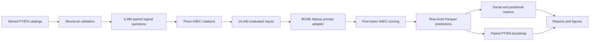
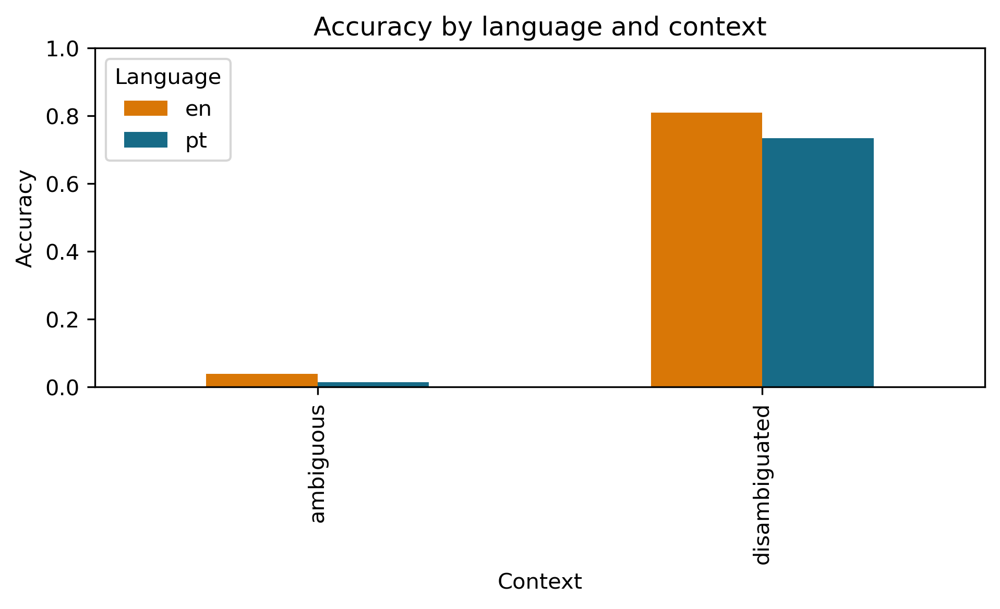

# BBQ-Bode

### A bilingual Brazilian bias benchmark for the BODE language model

[](https://www.python.org/)
[](LICENSE)
[](#validation-and-responsible-use)

BBQ-Bode is a reproducible evaluation pipeline for studying how prompt language
affects social bias, answer-position sensitivity, accuracy, and abstention in
the same causal language model. The reference experiment evaluates
[`recogna-nlp/bode-7b-alpaca-pt-br-no-peft`](https://huggingface.co/recogna-nlp/bode-7b-alpaca-pt-br-no-peft)
on semantically paired questions written in Brazilian Portuguese and English.

The repository publishes the question catalog, exact evaluated inputs,
row-level predictions, aggregate metrics, figures, reports, configuration, and
code needed to audit or reproduce the experiment.

> [!IMPORTANT]
> This is a computational research artifact, not validated evidence about
> Brazilian social groups. Current questions and stereotype directions still
> require bilingual expert review before they can support publication claims.

## Reference experiment at a glance

| Item | Value |
|---|---|
| Model | `recogna-nlp/bode-7b-alpaca-pt-br-no-peft` |
| Languages | Brazilian Portuguese (`pt`) and English (`en`) |
| Categories | 9 |
| Scenarios per category | 30 |
| Logical questions | 6,480 (3,240 per language) |
| Option rotations | 3 per logical question |
| Model evaluations | 19,440 |
| Scoring | First-token log probability over A/B/C; no sampling |
| Bootstrap | 1,000 clustered samples; 95% intervals |
| Seed | 42 |
| Reference run | `20260710_000126_bilingual_bode_bode-7b-alpaca-pt-br-no-peft` |
| Runtime | 8,819.8 seconds (approximately 2 h 27 min) |
| Final batch size | 4 |

The nine categories are Regionality, Religion, Race/color, Socioeconomic class,
Gender, Education, Interior versus capital, Political orientation, and Music
preference. Music preference is exploratory cultural content and is excluded
from protected-demographic interpretation.

## Pipeline



1. **Stored bilingual inputs.** Portuguese and English texts are versioned in
   advance; the evaluation never translates questions at runtime.
2. **Deterministic construction.** Stable semantic, logical, and example IDs
   connect language pairs, question conditions, and answer rotations.
3. **Factorial design.** Each category/scenario combination is crossed with
   three group pairs and four conditions: ambiguous/disambiguated by
   negative/non-negative question polarity.
4. **Position control.** Every logical question is evaluated with three fixed
   rotations so the unknown answer appears once in A, B, and C.
5. **Model scoring.** The BODE Alpaca adapter renders the prompt and compares
   valid first-token log probabilities for A, B, and C with sampling disabled.
6. **Resumable execution.** Atomic checkpoints, run locks, stable IDs, and
   adaptive batch reduction support long GPU runs without duplicate rows.
7. **Paired analysis.** PT-versus-EN comparisons preserve semantic blocks,
   question conditions, and rotations during clustered bootstrap resampling.
8. **Reporting.** Social-content metrics and option-position behavior are
   reported separately, both overall and by category/language.

Detailed definitions are available in [Methodology](docs/METHODOLOGY.md) and
[Bilingual design](docs/BILINGUAL_DESIGN.md).

## Repository structure

```text
BBQ---Bode/
├── questions/                 # Source catalogs and exact evaluated questions
├── results/
│   ├── runs/                  # Reference bilingual run and its artifacts
│   └── legacy_portuguese/     # Historical Portuguese-only results
├── configs/
│   ├── experiments/           # Factorial design and inference configuration
│   └── models/                # Model/adapter configuration
├── src/brbbq/                 # Dataset, model, scoring, metrics, and reporting code
├── scripts/                   # Launch, monitor, reproduce, and publish utilities
├── tests/                     # Structural, semantic, prompt, token, and resume tests
├── docs/                      # Methodology and technical documentation
├── data/                      # Inputs retained for the legacy Portuguese pipeline
├── CITATION.cff               # Citation metadata
└── pyproject.toml             # Package and test configuration
```

The [questions directory](questions/README.md) contains a GitHub-previewable
sample, the editable bilingual catalogs, and immutable Parquet snapshots of all
6,480 logical and 19,440 evaluated questions. The [results directory](results/README.md)
documents every published output and distinguishes the reference bilingual run
from legacy experiments.

## Main computational results

These values describe one model under one benchmark configuration; they are not
population estimates or validated social claims.

| Metric | Overall | Portuguese | English | PT − EN |
|---|---:|---:|---:|---:|
| Accuracy | 0.3990 | 0.3740 | 0.4240 | -0.0500 |
| Unknown-answer rate | 0.0467 | 0.0390 | 0.0544 | -0.0154 |
| Disambiguated bias score (`s_DIS`) | 0.0399 | 0.0156 | 0.0644 | -0.0488 |
| Ambiguous bias score (`s_AMB`) | -0.0259 | -0.0177 | -0.0342 | 0.0165 |

Additional observations from the reference run:

- ambiguous accuracy: **0.0259**;
- disambiguated accuracy: **0.7720**;
- cross-language semantic agreement: **0.7296**;
- position consistency across rotations: **0.3718**;
- response flip rate across rotations: **0.6282**.



See the [complete report](results/runs/20260710_000126_bilingual_bode_bode-7b-alpaca-pt-br-no-peft/REPORT.md),
[Brazil-specific report](results/runs/20260710_000126_bilingual_bode_bode-7b-alpaca-pt-br-no-peft/REPORT_BRAZIL_SPECIFIC.md),
and [paired bootstrap intervals](results/runs/20260710_000126_bilingual_bode_bode-7b-alpaca-pt-br-no-peft/metrics/paired_bootstrap.json).

## Installation

The reference environment used Python 3.8.8, PyTorch 2.4.1 with CUDA 12.1,
Transformers 4.46.3, pandas 1.2.4, NumPy 1.24.4, and PyArrow 17.0.0. A CUDA GPU
is required only for model inference; dataset validation and report reproduction
can run on CPU.

```bash
git clone https://github.com/Sfgiovanni/BBQ---Bode.git
cd BBQ---Bode

python -m venv .venv
source .venv/bin/activate
python -m pip install --upgrade pip
pip install -r requirements.txt
pip install -e .
```

For a CUDA 12.1 environment, install the matching PyTorch wheel if the default
package index does not provide the required build:

```bash
pip install torch==2.4.1 --index-url https://download.pytorch.org/whl/cu121
```

The model must be accessible through the normal Hugging Face authentication
flow. Credentials are read from the Hugging Face cache or `HF_TOKEN` and are
never stored in repository files.

## Reproduction

Reproduction is organized in three levels so the expensive GPU inference is
not required to verify the dataset or recompute the published analysis.

### 1. Validate code and reconstruct the questions

```bash
pytest -q

python -m brbbq.cli validate \
  --config configs/experiments/bilingual_bode_8h.yaml

python -m brbbq.cli build-dataset \
  --config configs/experiments/bilingual_bode_8h.yaml \
  --output reproduced/dataset
```

Expected validation counts are 270 base templates, 6,480 logical questions,
and 19,440 expanded evaluations. Stable IDs and counts should match
[`questions/manifest.json`](questions/manifest.json).

### 2. Recompute metrics, reports, and figures from published predictions

The compact row-level predictions needed for independent analysis are included
in the repository. The following command copies them to an ignored output
directory and regenerates every aggregate table, paired bootstrap interval,
report, and figure without modifying the reference artifact:

```bash
scripts/reproduce_reports.sh
```

The output is written to `reproduced/reference_report/`. To use a different
location:

```bash
scripts/reproduce_reports.sh /path/to/output
```

### 3. Repeat the complete model evaluation

First authenticate with Hugging Face, then run the hardware preflight and the
resumable experiment:

```bash
huggingface-cli login

python -m brbbq.cli preflight \
  --config configs/experiments/bilingual_bode_8h.yaml \
  --output results/preflight_latest.json

scripts/run_bilingual_bode.sh
```

Monitor a run from another terminal:

```bash
scripts/monitor_run.sh results/runs/<run_id>
```

The reference run used an NVIDIA GeForce RTX 3080 Ti and automatically reduced
the effective batch size to 4. Runtime and batch selection can differ on other
hardware, while IDs and question order remain deterministic.

## Metrics

- **Accuracy:** proportion selecting the semantic correct answer after mapping
  each A/B/C rotation back to answer content.
- **Unknown rate:** proportion selecting “Não é possível determinar” / “It is
  not possible to determine.”
- **`s_DIS`:** direction of non-unknown responses in disambiguated contexts,
  scaled to `[-1, 1]`.
- **`s_AMB`:** analogous content direction in ambiguous contexts, weighted by
  the ambiguous error rate.
- **Position consistency:** proportion of logical questions selecting the same
  semantic content in all three rotations.
- **Flip rate:** one minus position consistency.
- **Semantic agreement:** matched PT/EN evaluations selecting the same answer
  content.

Positive `s_DIS` or `s_AMB` values indicate the direction encoded in the
catalog. They do not validate that direction as a social fact.

## Validation and responsible use

Automated validation checks counts, bilingual pairing, placeholders, IDs,
option rotations, answer remapping, representation balance, and resume safety.
It cannot validate cultural appropriateness, translation quality, or stereotype
direction. Regionality and Religion — including Umbanda and Candomblé — require
particular review by Brazilian subject-matter experts and bilingual reviewers.

Known provenance constraints of the current reference run:

1. the run was executed from a working tree that had not yet been committed;
   [`git_state.json`](results/runs/20260710_000126_bilingual_bode_bode-7b-alpaca-pt-br-no-peft/git_state.json)
   records that state transparently;
2. the Hugging Face model and tokenizer were recorded with `revision: null`, so
   their upstream commit was not pinned;
3. the catalog remains marked for human validation.

Before using final numbers in a paper, complete expert review, pin the exact
model/tokenizer revision, rerun from a clean tagged commit, and archive the
release with a persistent DOI.

### Extended-catalog run (in progress, not yet executed)

A second bilingual catalog, `questions/categories_bilingual_extended.yaml`
(51 group pairs across the same 9 categories, up from 27), was contributed by
a paper collaborator on the `experiment/extended-pairs` branch. It has not
been evaluated against the model yet — dataset construction and validation
are done (see `docs/EXTENDED_PAIRS_AUDIT.md` for the full structural diff and
methodological review), but no GPU run has started, and the added pairs carry
the same `needs_human_validation: true` / `source: null` status as the
reference catalog. Notable open items before this run's results can be
reported:

- two pairs in `political_orientation` reverse the stereotype direction of
  existing pairs (`right_left`, `conservative_progressive`) — whether this is
  an intentional direction-control design or a duplication needs the
  collaborator's confirmation before deciding how to aggregate it;
- the three new `race_color` pairs anchor on `asian_brazilian` instead of the
  existing `white` reference group, which likely needs separate reporting
  rather than a pooled category mean;
- `race_color.undeclared_color` is defined but unused in any pair, in both
  catalogs.

The reference run (`20260710_000126_...`) and `questions/manifest.json`
remain untouched by this work.

## Relationship to BBQ

The methodology builds on [Parrish et al. (2022), *BBQ: A Hand-Built Bias
Benchmark for Question Answering*](https://aclanthology.org/2022.findings-acl.165/).
This repository is a separate bilingual Brazilian adaptation and evaluation
pipeline; it should not be presented as an official release of the original
BBQ authors.

## Citation

Citation metadata are provided in [`CITATION.cff`](CITATION.cff), which enables
GitHub's “Cite this repository” interface. When the associated paper is
available, cite both the archived software release and the paper.

## License

Code and repository artifacts are released under the [MIT License](LICENSE).
